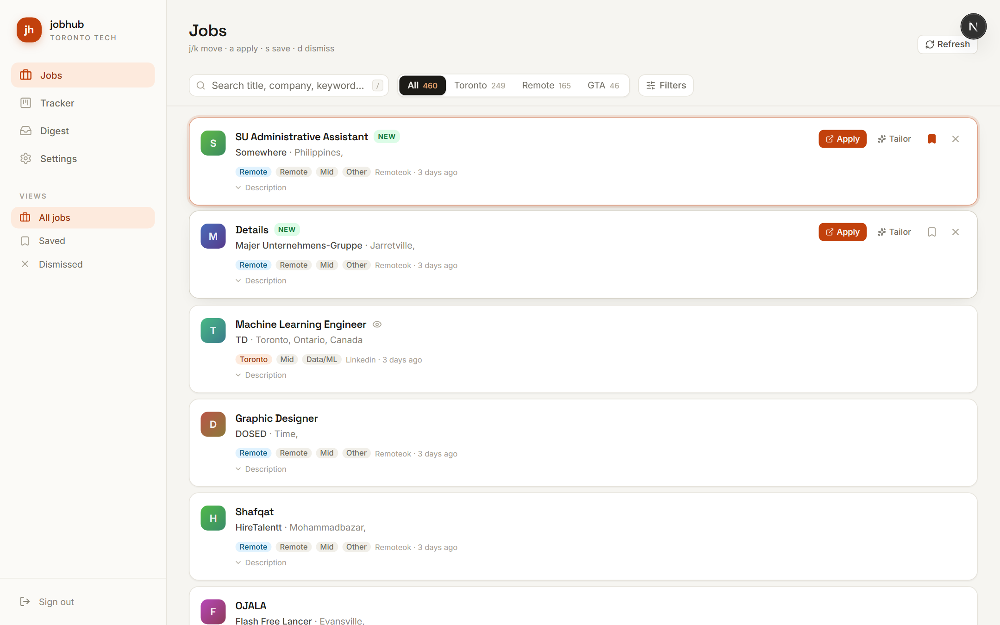
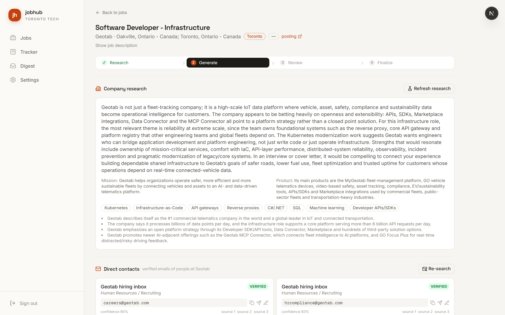
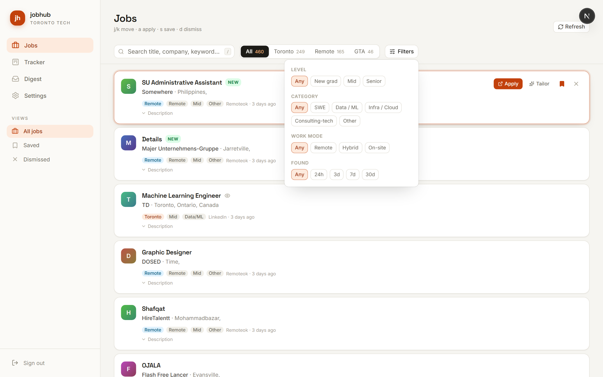
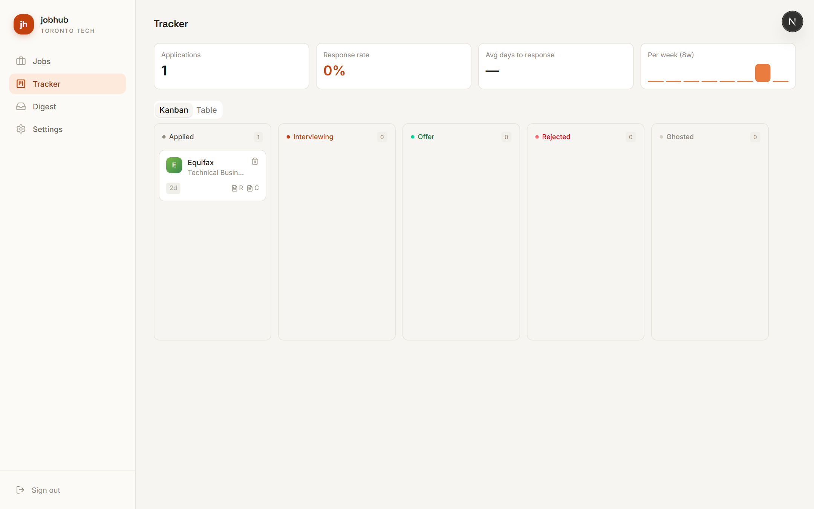
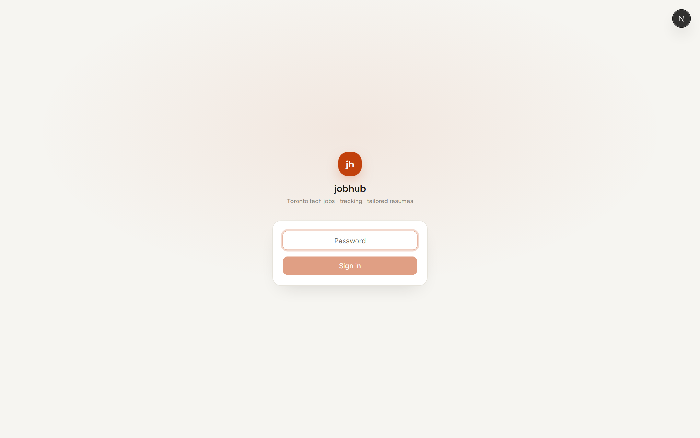
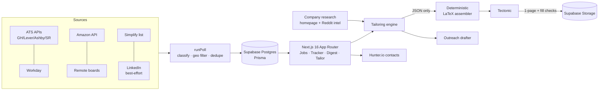

<div align="center">

# jobhub

**A personal job-search operating system for the Toronto tech market.**

Aggregates new-grad & mid-level tech postings from 38 sources, tracks every application
from click to outcome, and generates design-locked, one-page tailored résumé + cover-letter
PDFs from master LaTeX files — then finds verified recruiter contacts and drafts the
outreach email to go with them.


</div>

---

## Screenshots

| Job triage — keyboard-first, live counts | Tailor — research, contacts, 1-page PDFs |
| :---: | :---: |
|  |  |

| Filters | Tracker | Login |
| :---: | :---: | :---: |
|  |  |  |

## What it does

### 1. Aggregates the whole market, on a schedule
- **38 source adapters** polling in the background: direct ATS APIs (Greenhouse, Lever, Ashby,
  SmartRecruiters), Workday boards (TD, BMO, Salesforce, GM, SOTI, Interac), Amazon's jobs API,
  Simplify's new-grad list, Remotive / RemoteOK / WeWorkRemotely, and a best-effort LinkedIn
  guest-search adapter (isolated — its failures never touch the rest).
- **Explicit location policy**: Toronto → always in; GTA-commutable → in; anything else → only if remote.
- Fuzzy cross-source dedupe, internship exclusion (full-time focus), seniority/category classifiers.
- Per-source failure isolation + a poll-run health log — one dead source never takes the pipeline down.

### 2. Tracks every application, including the ones you'd forget
- Clicking **Apply** opens the posting and marks the job viewed; when you return to the tab it asks
  **"Did you apply to X?"** — yes opens a prefilled form, no dismisses forever.
- Kanban + sortable table, status pipeline, notes, aging indicators (amber 14d / red 30d without response),
  and analytics (applications/week, response rate, time-to-first-response).
- Jobs you're already tracking show an **Applied ✓** badge so you never double-apply.

### 3. Tailors résumé + cover letter per job — with hard guarantees
- **True LaTeX** (Tectonic), never HTML-to-PDF. Your master `.tex` files are the permanent source of truth.
- The LLM returns **JSON only**; a deterministic assembler re-injects it into the frozen template skeleton.
  Fonts, margins, section order, education, and company names **cannot** change — by construction.
- From-scratch, recruiter-tuned bullets (3 per entry, 18–28 words, punchy), skills re-ranked within your
  real vocabulary, **best-2-projects picked from your actual repos** for each role, title optimization
  within honesty rules (same seniority, same function).
- **Fabrication tripwire**: any number not present in your source material triggers regeneration, then a visible warning.
- **Objective page metrics**: must compile to exactly 1 page *and* fill it (measured from the PDF's text geometry).
- Every version stores its `.tex`, PDF, diff vs master, page count, fill %, ATS keyword coverage, and timestamp.

### 4. Finds the human, then drafts the email
- **Verified contacts** per company (Hunter.io): recruiter/hiring-manager emails with confidence scores,
  public source links, and deliverability checks. Companies with no public footprint fall back to
  GPT-known names × the company's confirmed email pattern × verification (labeled "pattern-matched").
- **Outreach drafts** grounded in your finalized résumé, the company research, and **Reddit candidate
  intel** (PullPush digest of real interview threads) — ≤120 words, proven structure, zero template smell.

## Architecture



## Stack

| Layer | Choice |
| --- | --- |
| Framework | Next.js 16 (App Router, TypeScript), Turbopack |
| UI | Tailwind v4 + shadcn/ui (Base UI), warm-paper theme, Space Grotesk + Inter |
| DB | Supabase Postgres + Prisma 6 |
| Storage | Supabase Storage (generated PDFs) |
| LLM | OpenAI `gpt-5.5` (JSON mode only) |
| LaTeX | Tectonic static binary (`scripts/setup-tectonic.mjs`, per-platform) |
| Scheduling | Vercel Cron (`/api/cron/poll`), optional Inngest, manual refresh |
| Auth | Single-password gate (HMAC cookie via `proxy.ts`) |

## Quickstart

```bash
# 1. Supabase project → paste 4 values into .env.local (+ DB strings into .env for the Prisma CLI)
cp .env.example .env.local

# 2. install + db + seed (masters + 30+ verified company sources)
npm install
npm run db:push
npm run db:seed

# 3. LaTeX compiler
npm run setup:tectonic

# 4. run
npm run dev   # http://localhost:3000
```

Required env: `DATABASE_URL`, `DIRECT_URL`, `SUPABASE_URL`, `SUPABASE_SERVICE_ROLE_KEY`,
`OPENAI_API_KEY`, `APP_PASSWORD`, `SESSION_SECRET`, `CRON_SECRET`.
Optional: `HUNTER_API_KEY` (contact discovery), `ADZUNA_APP_ID/KEY`, `OPENAI_MODEL`.

## Commands

| Script | What it does |
| --- | --- |
| `npm run dev` | Dev server |
| `npm run build` | Production build (downloads Tectonic first) |
| `npm run poll` | One aggregation cycle from the CLI |
| `npm run db:push` / `db:seed` | Prisma schema push / seed masters + sources |
| `npx tsx scripts/test-tailor.ts` | Tailoring smoke test (compile, pages, fill %, frozen sections) |
| `node scripts/e2e-ui.mjs` | Headless-browser click-through (14 checks) |

## Deployment (Vercel)

1. Push to GitHub, import into Vercel, add env vars.
2. Build downloads the Linux Tectonic binary automatically.
3. `vercel.json` registers the daily poll cron; use Inngest (free tier) for every-4-hours.

## Deliberate omissions

- **No LinkedIn/Indeed login scraping** (ToS + account risk) — LinkedIn uses the public guest
  search endpoint, isolated and best-effort. Disable with `LINKEDIN_ADAPTER=off`.
- **No JSearch/RapidAPI** (ToS gray area).
- **No multi-user auth** — single-user by design.

## License

MIT — see [LICENSE](LICENSE).
